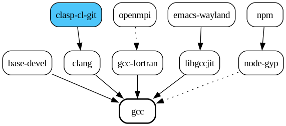

<div align="center">
  

# The Aura Package Manager

[](http://hackage.haskell.org/package/aura)
[](https://crates.io/crates/aura-pm)

[](https://stats.uptimerobot.com/xacx44XVJx/797414036)

  <div>
    :uk:
    :jp:
    :croatia:
    :sweden:
    :de:
    :es:
    :portugal:
    :fr:
    :ru:
    :it:
    :serbia:
    :norway:
    :indonesia:
    :cn:
    :netherlands:
    :tr:
    :saudi_arabia:
    :ukraine:
    :romania:
    :vietnam:
    :czech_republic:
    :kr:
    :india:
  </div>
  <br>
  
</div>

Welcome to the main repository for Aura, a multilingual package manager for Arch Linux.

Looking for help? Try:

- [The Aura Book](https://fosskers.github.io/aura/) for the online Manual.
- `info aura` for an offline variant of the Book.
- `man aura` for a detailed explanation of the entire command-line interface.
- `aura -h` for simple CLI help.

Looking to migrate from Aura 3 to Aura 4? See the [Migration
Guide](https://fosskers.github.io/aura/migration.html).

<!-- markdown-toc start - Don't edit this section. Run M-x markdown-toc-refresh-toc -->
**Table of Contents**

 - [What is Aura?](#what-is-aura)
 - [The Aura Philosophy](#the-aura-philosophy)
     - [Aura is Pacman](#aura-is-pacman)
     - [Arch is Arch - AUR is AUR](#arch-is-arch---aur-is-aur)
     - [Downgradibility](#downgradibility)
     - [Independence](#independence)
     - [Multilingualism](#multilingualism)
 - [Installation](#installation)
     - [From the AUR](#from-the-aur)
         - [The Tagged Release](#the-tagged-release)
         - [The `git`-based Build](#the-git-based-build)
         - [The Prebuilt Binary](#the-prebuilt-binary)
     - [Building from Source](#building-from-source)
     - [Post-installation](#post-installation)
 - [Sample Usage](#sample-usage)
 - [Configuration](#configuration)
 - [Localisation](#localisation)
 - [Credits](#credits)

<!-- markdown-toc end -->

## What is Aura?

Aura is a package manager for Arch Linux. Its original purpose was in
supplementing Pacman to support the building of AUR packages, but since its
creation in 2012 it has evolved to enable a variety of use cases.

## The Aura Philosophy

### Aura is Pacman

Aura doesn't just mimic `pacman`; it *is* `pacman`. All `pacman` operations and
their sub-options are accepted, as-is.

### Arch is Arch - AUR is AUR

Aura does not augment or alter `pacman`'s commands in any way.

`-S` yields repository packages and <u>only</u> those. In Aura, the `-A` operation is
introduced for obtaining AUR packages. `-A` comes with sub-options you're used
to (`-u`, `-s`, `-i`, etc.) and adds new ones to enhance AUR interaction.

### Downgradibility

Aura allows you to downgrade individual packages to previous versions with `-C`.
It also handles snapshots of your entire system, so that you can roll back whole
sets of packages when problems arise. The option `-B` will save a package state,
and `-Br` will restore a state you select. `-Au` also invokes a save
automatically.

### Independence

Aura has its own configuration file, its own local package cache, and its own
[Metadata Server][faur] called the Faur. The Faur in particular helps reduce
traffic to the main AUR server and allows us to provide unique package lookup
schemes not otherwise available.

### Multilingualism

English is the dominant language of computing and the internet. That said, it's
natural that some people are going to be more comfortable working in their
native language. From the beginning, Aura has been built with multiple-language
support in mind, making it very easy to add new ones via the [Project
Fluent][fluent] format.

[faur]: https://github.com/fosskers/faur
[fluent]: https://projectfluent.org/

## Installation

### From the AUR

#### The Tagged Release

[The recommended package](https://aur.archlinux.org/packages/aura) is simply
named `aura`. It uses `cargo` to build a fresh binary on your machine, based on
releases made to Rust's [crates.io](https://crates.io/crates/aura-pm).

```bash
git clone https://aur.archlinux.org/aura.git
cd aura
makepkg -s
sudo pacman -U <the-package-file-that-makepkg-produces>
```

#### The `git`-based Build

If instead you'd like to directly track updates to Aura's `master` branch, install
[the `git` variant](https://aur.archlinux.org/packages/aura-git):

```bash
git clone https://aur.archlinux.org/aura-git.git
cd aura-git
makepkg -s
sudo pacman -U <the-package-file-that-makepkg-produces>
```

#### The Prebuilt Binary

Finally, if you don't wish to build Aura yourself or want to avoid any trace of
Rust tooling on your machine, there is a [prebuilt
binary](https://aur.archlinux.org/packages/aura-bin/) of Aura for `x86_64`
machines:

```bash
git clone https://aur.archlinux.org/aura-bin.git
cd aura-bin
makepkg -s
sudo pacman -U <the-package-file-that-makepkg-produces>
```

### Building from Source

If you already have Rust tooling installed on your machine and/or wish to help
develop Aura, you can also install it manually:

```bash
git clone https://github.com/fosskers/aura.git
cd aura/rust
cargo install --path aura-pm
```

This will build and install the binary to `/home/YOU/.cargo/bin/`.

Keep in mind that this variant of Aura won't be tracked in `pacman`'s database,
and so it will be easier to miss updates. It also does not install completions
or other documentation files like manpages.

### Post-installation

The first thing you should do is run `check`:

```bash
aura check
```

This will scan your system for irregularities and suggest fixes. Second, you
should generate an Aura config file:

```bash
aura conf --gen > ~/.config/aura/config.toml
```

Consider setting the `language` field here, if you wish to use Aura in a
language other than English. The available language codes are viewable via:

```bash
aura stats --lang
```

Aura will also automatically detect your locale via `LANG`, so you only need to
set `language` if you want a custom combination of system language and Aura
language.

## Sample Usage

Full usage information can be found in Aura's man page and within [The
Book](https://fosskers.github.io/aura/usage.html).

> **❗ Attention:** As of the 4.x series, `sudo` is no longer necessary when
> running Aura. When escalated privileges are required, Aura will automatically
> prompt you.

- [`-A`](https://fosskers.github.io/aura/aur.html): Search and install packages from the AUR.
```
> aura -A qlot
```

- [`-B`](https://fosskers.github.io/aura/snapshots.html): Create and restore snapshots of installed packages.
```
> aura -B
aura :: Saved package state.
```

- [`-C`](https://fosskers.github.io/aura/downgrading.html): Downgrade installed packages.
```
> aura -C qlot
aura :: What version of qlot do you want?
 0) 1.5.6-1
 1) 1.5.1-1
>>
```

- [`-L`](https://fosskers.github.io/aura/log.html): Search and inspect the ALPM log.
```
> aura -Li firefox
Name           : firefox
First Install  : 2016-05-03 08:46
Upgrades       : 176
Recent Actions : 
[2024-02-24T07:29:46+0900] [ALPM] upgraded firefox (122.0.1-1 -> 123.0-1)
[2024-03-11T16:42:37+0900] [ALPM] upgraded firefox (123.0-1 -> 123.0.1-1)
[2024-03-24T15:03:33+0900] [ALPM] upgraded firefox (123.0.1-1 -> 124.0.1-1)
```

- [`-O`](https://fosskers.github.io/aura/orphans.html): Handle "orphans" - dependencies whose parent package is no
  longer installed.
```
> aura -O
asar 3.2.8-1
```

- `check`: Validate your system.
```
> aura check
aura :: Validating your system.
aura :: Environment
  [✓] locale -a contains LANG value? (en_US.UTF-8)
  [✓] Aura is localised to your LANG?
  [✓] EDITOR variable set?
  [✓] EDITOR value (emacs) is executable?
  [✓] Java environment set?
... etc. ...
```

- [`conf`](https://fosskers.github.io/aura/configuration.html): Inspect or generate Aura configuration.
```
> aura conf --gen > ~/.config/aura/config.toml
```

- [`deps`](https://fosskers.github.io/aura/deps.html): View the dependency graph of given packages.
```
> aura deps gcc --reverse --optional --limit=3 --open
```
<p align="center">
  
</p>

- `free`: List installed packages with potentially non-free software licenses.
```
> aura free
adobe-source-code-pro-fonts: custom
aspell-en: custom
blas: custom
boost: custom
boost-libs: custom
cantarell-fonts: custom:SIL
... etc. ...
```

- `stats`: View statistics about your machine and Aura itself.
```
> aura stats
Host                 : yumi
User                 : colin
Distribution         : Arch Linux
Editor               : emacs
Installed packages   : 1144
Pacman Package Cache : 7.05GiB
Aura Package Cache   : 1.29GiB
Aura Build Cache     : 6.49GiB
/tmp Directory       : 11.31MiB
```

- `thanks`: Credit to the Pacman team, Aura's authors, and Aura's translators.

## Configuration

Aura looks for a configuration file at `~/.config/aura/config.toml`, but won't
break if one isn't present. To generate one:

``` bash
aura conf --gen > ~/.config/aura/config.toml
```

Configuration details can be found in [The
Book](https://fosskers.github.io/aura/configuration.html) or within `info aura`.

## Localisation

As mentioned in the Philosophy above, adding new languages to Aura is quite
easy. If you speak a language other than those available and would like it added
to Aura, please see the
[Localisation](https://fosskers.github.io/aura/localisation.html) section of The
Aura Book.

## Credits

Aura has been translated by these generous people:

| Language   | Translators                                     |
|------------|-------------------------------------------------|
| Arabic     | "Array in a Matrix"                             |
| Chinese    | Kai Zhang and Alex3236                          |
| Croatian   | Denis Kasak and "stranac"                       |
| Czech      | Daniel Rosel                                    |
| Dutch      | Joris Blanken and Heimen Stoffels               |
| Esperanto  | Zachary "Ghosy" Matthews                        |
| French     | Ma Jiehong and Fabien Dubosson                  |
| German     | Lukas Niederbremer and Jonas Platte             |
| Hindi      | "yozachar"                                      |
| Indonesian | "pak tua Greg"                                  |
| Italian    | Bob Valantin and Cristian Tentella              |
| Japanese   | Colin Woodbury and Onoue Takuro                 |
| Korean     | "Nioden"                                        |
| Norwegian  | "chinatsun"                                     |
| Polish     | Chris Warrick, Michał Kurek                     |
| Portuguese | Henry Kupty, Thiago Perrotta, and Wagner Amaral |
| Romanian   | "90", "benone"                                  |
| Russian    | Kyrylo Silin, Alexey Kotlyarov                  |
| Serbian    | Filip Brcic                                     |
| Spanish    | Alejandro Gómez, Sergio Conde and Max Ferrer    |
| Swedish    | Fredrik Haikarainen and Daniel Beecham          |
| Turkish    | Cihan Alkan                                     |
| Ukrainian  | Andriy Cherniy                                  |
| Vietnamese | "Kritiqual"                                     |

Aura's logo is thanks to the designer [Cristiano Vitorino](https://github.com/cristianovitorino).

