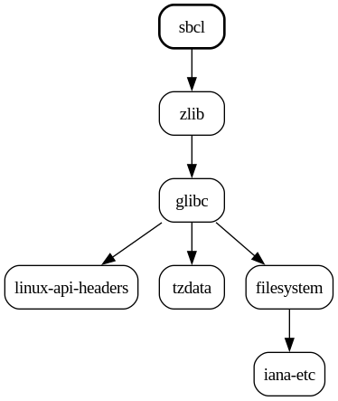
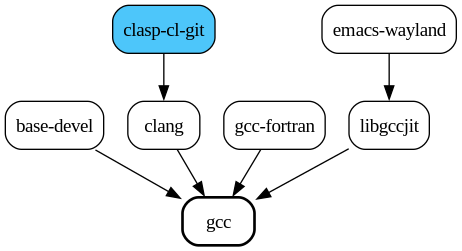

# Dependency Analysis

Sometimes you might notice a certain package that you don't recognize
nonetheless being updated, and you'd like to know where it came from. Or perhaps
you'd like to know what the affect of installing some package might be, in terms
of dependency load. The output of `-Qi` and `-Si` includes dependency
information, but only one layer deep in either direction. In these cases, `aura
deps` is a useful command.

By default it writes a `.png` to the current directory, but with `--open` will
output to `/tmp` and open the image in the default viewer instead. If the image
isn't opening in the viewer you prefer, you can alter it in
`~/.config/mimeapps.list`. For instance:

```
[Default Applications]
image/png=swayimg.desktop
```

The available `.desktop` entries can be found in `/usr/share/applications/`.

## Displaying Dependencies

```
> aura deps sbcl --open
```

<p align="center">
  
</p>

Looks like `sbcl` is fairly self-contained. Many packages are not, and their
output needs to be limited to render usefully. For instance...

```
> aura deps gcc --open
```

<p align="center">
  
</p>

Ack! Let's try again, but with `--limit` this time:

```
> aura deps gcc --limit=3 --open
```

<p align="center">
  
</p>

## Display Reverse Dependencies

Wait a minute, what's this `gcc` thing anyway? Doesn't sound very important. I
want it off my system! Let's see...

```
> aura deps gcc --reverse --open
```

<p align="center">
  
</p>

...nevermind. Note that cyan nodes indicate AUR packages.
